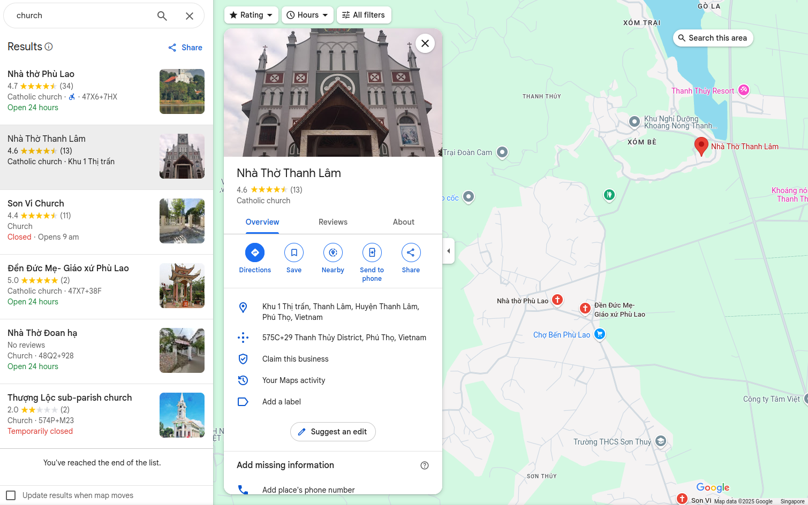
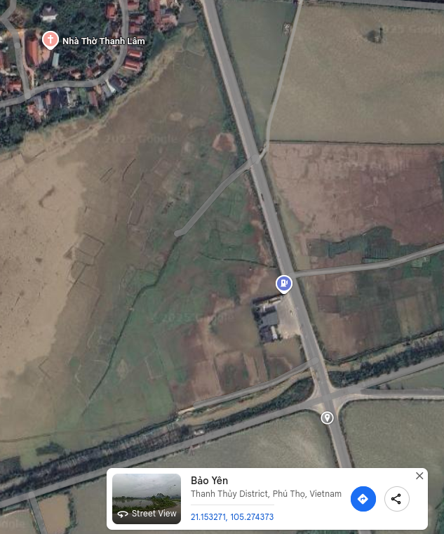

# By The Banana Tree OSINT Challenge
## Difficulty 2/5, Personal Difficulty 5/5, Time spent 24hrs, Tools Used: Google Maps/Earth
Courtesy of the ctf organizers, the attached picture is all that is given for this particular challenge.

Being new to competitions as such, I started with the naive method. I tried to reverse google image search the given image, unfortunately, with limited success. But it did give me the idea the knowledge that this location would be in a foreign country given that nothing that popped up was easily legible by my poor untrained eyes. Thus, heading off to a great start I decided to look back upon the given resource above.

What did I find? Well I started off looking left to right, top to bottom. The scenery starting off with the hills in the back are reminiscent of the beauty of our own local landmarks such as little guilin at bukit batok. Wonderful place to go for a short walk if you dear reader find the time and are in the area. Full with lustruous greenery there are few human made landmarks in the picture, of the few that are available a church, traffic light, light pole, and road post can be seen. 

Now I don't find myself to be a very devoted catholic, but even I know that in whichever religious country it could be, there would be a multitude of churches built for their little cult. So narrowing it based on the building or scenery seemed like impossible at the moment. That left the remaining items once again. 

Lets look back at the picture. My next flash of inspiration came from the signs, surely certain color schemes are reserved or employed by certain countries. Yes, but no. Wikipedia will have you know of a multitude of countries that use the color blue for their signs, but it made me realize that if I were to spend looking at the signs of every country with blue on white signs, I might end up in a nursing home first. 

Logically, this means that we should narrow down to a country first. But with only a road, I was quite literally stumped. So I just decided to try my luck with the stump containing the only legible words in the picture. QL32 and DT317G. Surprisingly, perhaps not to the experienced, this actually resulted in a set of roads in Vietnam! The hunt was on. I progressed, felt like a king and decided that even if I had to look at all the churches near these roads I would. And that's exactly what I did.

Of course our dear sadistic ctf overlords decided to choose roads that did not have any street views. Please don't take this the wrong way, it was just frustrating because I had the genius idea of first looking at only available street views. I ended up in a lot of houses of strangers and seeing a lot of blurred and cut off people. Not good for your health if you are doing it alone at home in the middle of the night and start wondering if they were really people or part of a hidden google creepypasta that no one told me about. Anyways, back to the point, this clearly resulted in nothing. Limited street views was just for my own viewing pleasure, the tea fields seemed like a great place to visit.

The churches on the roads were in varying states. Many very different. I decided to take a break when i was about halfway through looking at the road, when I had the epiphany that maybe just maybe the keywords I found was meant to be combined with the metering on the stump. At this point I had probably gone through every church that lied on QL32 at least three times without success, so I wanted to try something different. Off the intersection between QL32 and DT317, because I did not see no DT317G anywhere, I would use a ruler to get a rough approximation of 12 km from that point. Then I would re-do my search but focused solely on that area.

With renewed hope, I decided to narrow churches to this area, see what I could find, and find something I did. Unfortunately, something I only realized a long time after confusion, I found a church with a wonderful picture, infamously known as Nha tho Phu Lao, it was the exact church. In hindsight, my gut told me there was no way that a picture could be taken of the church in the same angle as the challenge as either the roads or scenery would not match with the overall land. So happy I went, and assuming that the title was a hint I just went ahead and chose a spot that looked the most and like a banana tree and decided those were the coordinates for my flag.

# BIG FAT FAIL
## But not entirely
Given that there was a picture of the church in this location, my spider senses where tingling. After all, it was quite possible for a tourist to mistakenly remember where he took his picture in a country where there is a church apparently every few meters. Or perhaps it was an intentional sabotage by our dear moderator team. Either ways, for the sake of my own sanity I decided to give the mods the benefit of the doubt.

I zoomed into maps to get the rough location of the area and searched for the most generic keyword **church**. Methodically I went through the nearest churches to try and find a hit. And lo and behold we found our baby. 

From the picture above we can see that the church faces two possible intersections, which is of interest to us because of the challenge picture. But to be sure I had to look at the topological data to confirm the final position.

Scrutinizing very closely we can see that the shadow of the front part of the church is overcasting the roof of the rest of the building. Which means that the front of the church which we can see from the picture is facing the valley of grass towards the gas station. Given the lack of roads there and only a major intersection, it is safe to assume that this is the location from which the picture was taken and is marked in the screenshot with coordinates.

Thankfully, after hours of torment. This was the correct location. Overall I'd say it was a fun experience if albeit slightly maddening. Thank you mods.
